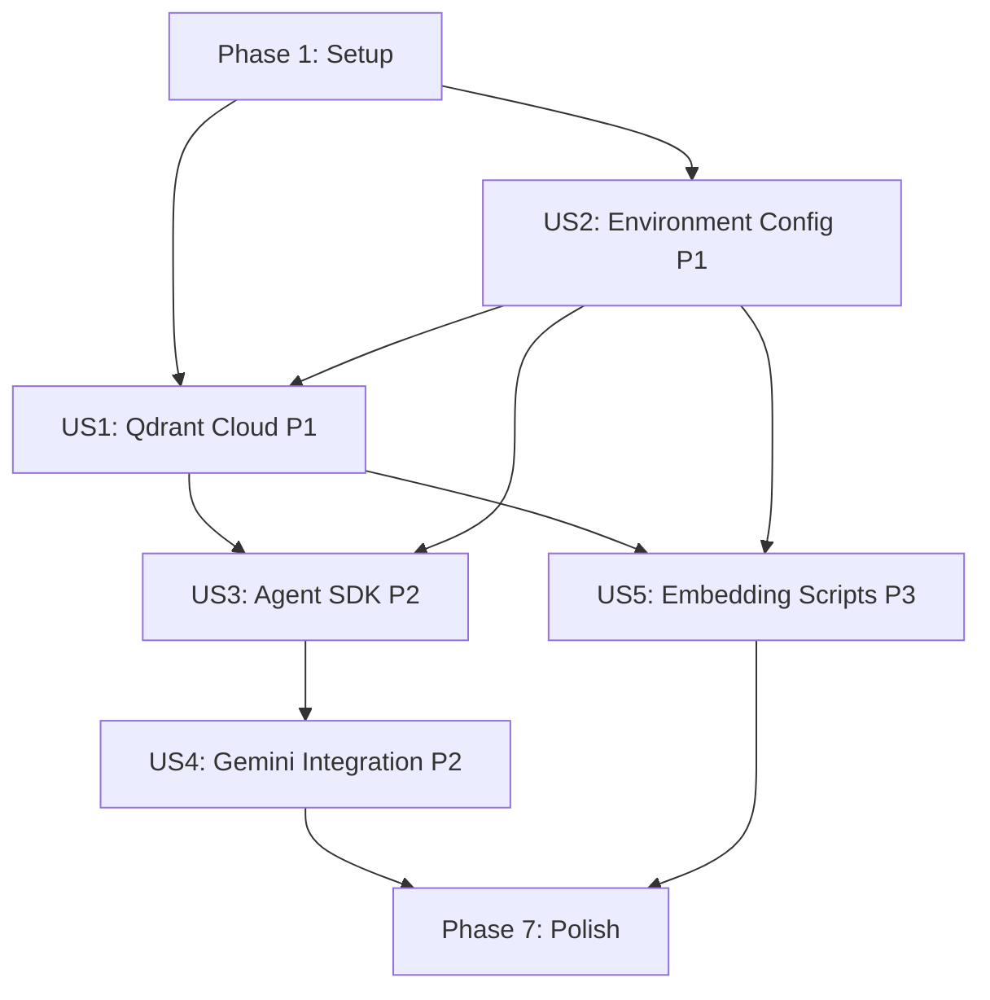

# Implementation Tasks: Backend Tech Stack Refactor

**Feature**: Backend Tech Stack Refactor - OpenAI Agents SDK + Qdrant Cloud
**Branch**: `007-backend-tech-stack-refactor`
**Date**: 2025-12-28
**Plan**: [plan.md](./plan.md) | **Spec**: [spec.md](./spec.md)

## Overview

This document breaks down the backend refactor into executable tasks organized by user story for independent implementation and testing. Each user story represents a complete, testable increment of functionality.

**Implementation Strategy**: MVP-first approach starting with P1 stories (Qdrant Cloud + Environment Config), then P2 stories (Agent SDK + Gemini), finally P3 stories (Embedding Modernization).

## User Story Mapping

| Story | Priority | Goal | Independent Test |
|-------|----------|------|------------------|
| **US1** | P1 | Qdrant Cloud Migration | Qdrant client connects to cloud cluster and executes queries |
| **US2** | P1 | Environment-Based Configuration | All credentials loaded from env vars, no hardcoded secrets |
| **US3** | P2 | OpenAI Agents SDK Integration | Agent processes query and retrieves textbook content |
| **US4** | P2 | Gemini Model Integration | Agent uses Gemini model via custom client |
| **US5** | P3 | Embedding Script Modernization | Embedding script indexes documents to Qdrant Cloud |

## Task Checklist

### Phase 1: Setup & Prerequisites

**Goal**: Initialize project structure and prepare for refactoring

- [ ] T001 Update requirements.txt with new dependencies (openai-agents-python>=0.2.9, openai>=1.50.0, pytest-asyncio>=0.21.0)
- [ ] T002 Create .env.example template with all required environment variables
- [ ] T003 [P] Create backend/src/config/__init__.py module
- [ ] T004 Remove docker-compose.yml Qdrant service configuration per TC-001
- [ ] T005 Remove local Qdrant fallback logic from backend/src/services/qdrant_service.py
- [ ] T006 [P] Create backend/src/agents/ directory structure (__init__.py, chatbot.py, models.py)
- [ ] T007 [P] Create backend/scripts/validate_env.py environment validation script
- [ ] T008 [P] Create backend/scripts/init_qdrant_collection.py collection initialization script

**Parallel Execution**: Tasks T003, T006, T007, T008 can run concurrently (different files, no dependencies)

### Phase 2: Foundational - Environment Configuration (US2 - P1)

**Story Goal**: Secure credential management via environment variables

**Independent Test**: All services initialize from env vars; code scan finds zero hardcoded secrets

- [ ] T009 [US2] Implement EnvironmentConfig class in backend/src/config/env.py with validation
- [ ] T010 [US2] Add required environment variable validation logic (QDRANT_CLUSTER_ENDPOINT, QDRANT_API_KEY required)
- [ ] T011 [US2] Add Gemini environment variable validation (GEMINI_BASE_URL, GEMINI_API_KEY, MODEL_NAME)
- [ ] T012 [US2] Implement fail-fast behavior on startup if required env vars missing
- [ ] T013 [P] [US2] Update backend/main.py to load and validate EnvironmentConfig on startup
- [ ] T014 [P] [US2] Update backend/.env.example with complete variable list and documentation

**US2 Acceptance Test**:
1. Set all required env vars → Application starts successfully
2. Remove QDRANT_API_KEY → Application fails with clear error message
3. grep -r "api.*key.*=" backend/src → No matches (no hardcoded secrets)

**Parallel Execution**: T013 and T014 can run concurrently after T009-T012 complete

### Phase 3: User Story 1 - Qdrant Cloud Migration (P1)

**Story Goal**: Migrate from local Docker Qdrant to managed Qdrant Cloud

**Independent Test**: Qdrant client connects to cloud cluster using env vars and executes test query

- [ ] T015 [US1] Refactor backend/src/database/qdrant_client.py to use cloud-only configuration
- [ ] T016 [US1] Replace local connection logic with QdrantClient(url=env.qdrant_cluster_endpoint, api_key=env.qdrant_api_key)
- [ ] T017 [US1] Add connection timeout configuration (10 seconds for cloud latency)
- [ ] T018 [US1] Implement health check method in qdrant_client.py (verify_connection())
- [ ] T019 [P] [US1] Update backend/src/services/qdrant_service.py to use refactored cloud client
- [ ] T020 [P] [US1] Add retry logic with exponential backoff for connection failures (3 attempts)
- [ ] T021 [P] [US1] Implement error handling for authentication failures (401) and network errors
- [ ] T022 [US1] Update health check endpoint (backend/src/api/chatbot_router.py) to verify Qdrant connectivity

**US1 Acceptance Test**:
1. Export QDRANT_CLUSTER_ENDPOINT and QDRANT_API_KEY
2. Run: python -c "from backend.src.database.qdrant_client import get_qdrant_client; client = get_qdrant_client(); print(client.get_collections())"
3. Expected: List of collections without errors
4. Test invalid credentials → Expect authentication error message

**Parallel Execution**: T019, T020, T021 can run concurrently after T015-T018 complete

### Phase 4: User Story 3 - OpenAI Agents SDK Integration (P2)

**Story Goal**: Implement conversational agent using OpenAI Agents SDK

**Independent Test**: Agent processes query, retrieves textbook content from Qdrant, returns response

**Dependencies**: Requires US1 (Qdrant Cloud) and US2 (Environment Config) complete

- [ ] T023 [US3] Create agent model factory in backend/src/agents/models.py (get_openai_model(), get_gemini_model())
- [ ] T024 [US3] Implement OpenAI model configuration with environment variable for API key
- [ ] T025 [US3] Create textbook chatbot agent in backend/src/agents/chatbot.py with instructions
- [ ] T026 [US3] Define agent instructions (You are a helpful assistant for Physical AI & Humanoid Robotics textbook...)
- [ ] T027 [US3] Implement agent initialization function (create_textbook_agent() returns Agent)
- [ ] T028 [US3] Create query processing function using Runner.run(agent, input=prompt)
- [ ] T029 [US3] Integrate Qdrant search into agent workflow (retrieve context documents before agent call)
- [ ] T030 [US3] Refactor backend/src/services/rag_service.py to use agent instead of direct LLM calls
- [ ] T031 [US3] Update RAG pipeline to pass retrieved documents as context to agent
- [ ] T032 [P] [US3] Remove deprecated ConversationSession model (SDK manages sessions internally)
- [ ] T033 [P] [US3] Update API response formatting to extract agent output and sources

**US3 Acceptance Test**:
1. Start application: uvicorn main:app --reload
2. POST /api/v1/chat with query: "What is ROS 2?"
3. Expected: Response with answer from agent and sources from Qdrant
4. Verify response processing_time_ms < 30000

**Parallel Execution**: T032 and T033 can run concurrently after T023-T031 complete

### Phase 5: User Story 4 - Gemini Model Integration (P2)

**Story Goal**: Enable Gemini model usage via custom OpenAI client

**Independent Test**: Agent configured with Gemini generates response from Gemini API

**Dependencies**: Requires US3 (Agent SDK Integration) complete

- [ ] T034 [US4] Implement get_gemini_model() in backend/src/agents/models.py
- [ ] T035 [US4] Create AsyncOpenAI client with base_url=env.gemini_base_url and api_key=env.gemini_api_key
- [ ] T036 [US4] Return OpenAIChatCompletionsModel(model=env.model_name, openai_client=gemini_client)
- [ ] T037 [US4] Add Gemini API key validation in EnvironmentConfig with graceful fallback to OpenAI
- [ ] T038 [US4] Update agent creation to use model factory pattern (select OpenAI vs Gemini based on env vars)
- [ ] T039 [P] [US4] Add error handling for Gemini API failures with fallback or clear error message
- [ ] T040 [P] [US4] Update health check endpoint to verify Gemini API connectivity (if configured)

**US4 Acceptance Test**:
1. Export GEMINI_BASE_URL, GEMINI_API_KEY, MODEL_NAME=gemini-2.5-flash-preview
2. Restart application
3. POST /api/v1/chat with query
4. Expected: Response generated by Gemini (verify via logs or response characteristics)
5. Test missing GEMINI_API_KEY → Expect graceful error or fallback to OpenAI

**Parallel Execution**: T039 and T040 can run concurrently after T034-T038 complete

### Phase 6: User Story 5 - Embedding Script Modernization (P3)

**Story Goal**: Update embedding scripts to use Qdrant Cloud configuration

**Independent Test**: Embedding script processes documents and stores in Qdrant Cloud

**Dependencies**: Requires US1 (Qdrant Cloud) and US2 (Environment Config) complete

- [ ] T041 [US5] Update backend/scripts/index_content.py to import EnvironmentConfig
- [ ] T042 [US5] Replace localhost Qdrant connection with get_qdrant_client() from database module
- [ ] T043 [US5] Update collection creation logic to use cloud client (if collection doesn't exist)
- [ ] T044 [US5] Add progress tracking for batch uploads (print status every 10 documents)
- [ ] T045 [P] [US5] Implement error recovery (skip failed documents, continue processing, log failures)
- [ ] T046 [P] [US5] Add summary output (total processed, successful, failed, duration, rate)
- [ ] T047 [US5] Update backend/scripts/validate_env.py to check Qdrant Cloud connectivity before indexing
- [ ] T048 [US5] Add command-line arguments (--source, --batch-size, --chunk-size, --chunk-overlap)

**US5 Acceptance Test**:
1. Run: python backend/scripts/index_content.py --source book-source/docs
2. Expected: Script processes documents, uploads to Qdrant Cloud
3. Verify collection exists: python -c "from backend.src.database.qdrant_client import get_qdrant_client; print(get_qdrant_client().get_collection('textbook_content'))"
4. Test sample query returns relevant results

**Parallel Execution**: T045, T046, T047, T048 can run concurrently after T041-T044 complete

### Phase 7: Polish & Cross-Cutting Concerns

**Goal**: Final integration, documentation, and quality checks

- [ ] T049 Update backend/README.md with Qdrant Cloud setup instructions
- [ ] T050 [P] Create migration guide documenting rollback procedure
- [ ] T051 [P] Update API documentation (contracts/api-spec.yaml) if any endpoints changed
- [ ] T052 Verify all hardcoded secrets removed (run: grep -r "AKIA\|sk-\|api.*key.*=" backend/src)
- [ ] T053 [P] Add logging for Qdrant Cloud operations (connection, queries, errors)
- [ ] T054 [P] Add logging for agent operations (initialization, queries, responses)
- [ ] T055 Review and update error messages for clarity and actionability
- [ ] T056 Performance test: Verify query latency <500ms (p95) against Qdrant Cloud
- [ ] T057 [P] Load test: Verify system handles concurrent queries without degradation
- [ ] T058 [P] Integration test: End-to-end workflow (query → Qdrant → agent → response)

**Parallel Execution**: Tasks T050, T051, T053, T054, T057, T058 can run concurrently

## Dependencies & Execution Order

### Story Dependencies (Sequential)



**Critical Path**: Setup → US2 → US1 → US3 → US4 → Polish

**MVP Scope** (Minimum Viable Product):
- Phase 1: Setup
- Phase 2: US2 (Environment Config)
- Phase 3: US1 (Qdrant Cloud Migration)

This MVP delivers secure cloud-based vector database connectivity, enabling subsequent agent and embedding work.

### Within-Story Parallelization

**US1 (Qdrant Cloud)**: After T015-T018 complete sequentially, T019, T020, T021 can run in parallel
**US3 (Agent SDK)**: After T023-T031 complete sequentially, T032, T033 can run in parallel
**US4 (Gemini)**: After T034-T038 complete sequentially, T039, T040 can run in parallel
**US5 (Embeddings)**: After T041-T044 complete sequentially, T045, T046, T047, T048 can run in parallel
**Polish**: Most tasks (T050, T051, T053, T054, T057, T058) can run in parallel

## Task Execution Examples

### Example 1: Implementing MVP (US1 + US2)

```bash
# Phase 1: Setup (parallel where possible)
git checkout 007-backend-tech-stack-refactor
# T001-T002 (sequential)
# T003, T006, T007, T008 (parallel)

# Phase 2: US2 - Environment Config
# T009-T012 (sequential - validation logic depends on class)
# T013-T014 (parallel)

# Phase 3: US1 - Qdrant Cloud
# T015-T018 (sequential - client refactor)
# T019, T020, T021 (parallel - different concerns)
# T022 (final integration)

# Test MVP
python backend/scripts/validate_env.py
pytest tests/integration/test_qdrant_cloud.py -v
```

### Example 2: Implementing US3 (Agent SDK)

```bash
# Prerequisite: US1 and US2 complete
# Phase 4: US3 - Agent SDK Integration
# T023-T031 (sequential - agent setup and integration)
# T032-T033 (parallel - cleanup tasks)

# Test US3
pytest tests/integration/test_agent_workflow.py -v
curl -X POST http://localhost:8000/api/v1/chat \
  -H "Content-Type: application/json" \
  -d '{"content": "What is ROS 2?"}'
```

### Example 3: Full Implementation

```bash
# Sequential by priority:
# P1: US2 + US1 (MVP - foundational)
# P2: US3 + US4 (agent capabilities)
# P3: US5 (embedding modernization)
# Polish: Cross-cutting concerns

# Within each phase, exploit parallelization
# Final validation
pytest tests/ -v --cov=backend/src
python backend/scripts/index_content.py --source book-source/docs
```

## Validation Checklist

### Pre-Implementation
- [ ] All design documents reviewed (plan.md, spec.md, data-model.md)
- [ ] Qdrant Cloud cluster provisioned with API credentials
- [ ] Gemini API key obtained (if using Gemini)
- [ ] Development environment setup (Python 3.10+, venv)

### Per User Story
- [ ] **US1**: Qdrant client connects to cloud, executes queries
- [ ] **US2**: All env vars loaded, zero hardcoded secrets (grep scan passes)
- [ ] **US3**: Agent processes query, retrieves Qdrant content, returns response
- [ ] **US4**: Gemini model generates response (verify via logs)
- [ ] **US5**: Embedding script indexes documents to Qdrant Cloud

### Post-Implementation
- [ ] All acceptance scenarios from spec.md pass
- [ ] Performance goals met (search <500ms p95, agent <30s)
- [ ] Security audit passes (no hardcoded secrets)
- [ ] Documentation updated (README, quickstart, API docs)
- [ ] Integration tests pass end-to-end
- [ ] Ready for `/sp.implement` or manual implementation

## Implementation Notes

### Critical Success Factors
1. **Environment First**: US2 must complete before other stories (security foundation)
2. **Qdrant Cloud Stability**: US1 is prerequisite for US3 and US5 (database availability)
3. **Agent SDK Understanding**: Review OpenAI Agents SDK docs before US3 implementation
4. **Gemini API Quirks**: Test Gemini integration thoroughly (US4 depends on custom client pattern)

### Common Pitfalls
- Forgetting to remove local Docker Qdrant references (T004, T005 critical)
- Hardcoding credentials during development (continuous grep scan recommended)
- Not testing with missing env vars (fail-fast behavior essential)
- Skipping error handling for network failures (cloud services can be flaky)
- Not validating collection schema matches embeddings (384-dim COSINE)

### Testing Strategy
- **Unit Tests**: Focus on environment validation, agent initialization, error handling
- **Integration Tests**: Qdrant Cloud connectivity, agent workflow, embedding pipeline
- **Manual Testing**: Use curl for API endpoints, run scripts for validation
- **Performance Testing**: Load test with concurrent queries, measure latencies

## Total Task Count

- **Setup (Phase 1)**: 8 tasks
- **US2 - Environment Config (P1)**: 6 tasks
- **US1 - Qdrant Cloud (P1)**: 8 tasks
- **US3 - Agent SDK (P2)**: 11 tasks
- **US4 - Gemini Integration (P2)**: 7 tasks
- **US5 - Embedding Scripts (P3)**: 8 tasks
- **Polish (Phase 7)**: 10 tasks

**Total**: 58 tasks across 7 phases

**Parallelizable**: 20 tasks marked with [P] (35% of total)

## Format Validation

✅ All tasks follow checklist format: `- [ ] T### [Labels] Description with file path`
✅ Task IDs sequential (T001-T058)
✅ User story labels correct ([US1]-[US5])
✅ Parallel markers ([P]) identify concurrent opportunities
✅ File paths specified for implementation tasks
✅ Independent test criteria per user story
✅ Dependency graph shows execution order
✅ MVP scope clearly identified (US1 + US2)

---

**Ready for Implementation**: This task breakdown is executable. Each task is specific enough for an LLM or developer to complete independently. User stories are independently testable, enabling incremental delivery and validation.

**Next Steps**: Run `/sp.implement` to begin automated implementation, or manually execute tasks in dependency order starting with Phase 1 (Setup).
